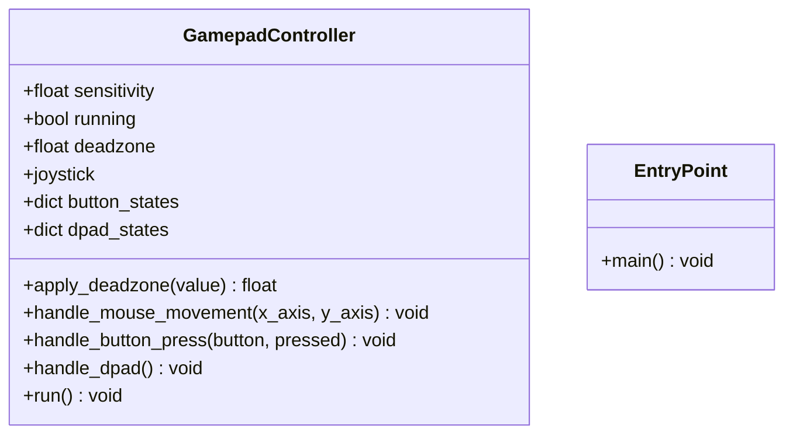

## JoyControl — управление курсором и клавишами ОС с геймпада

### 1. Структура проекта

```
├─ JoyControl.py
└─ README.md
```

### 2. Описание файлов

#### `JoyControl.py`
- **Назначение**: Захват событий геймпада через `pygame` и эмуляция действий мыши/клавиатуры через `pyautogui`.
- **Ключевые функции/классы**:
  - **Класс `GamepadController`**:
    - `__init__()`: Инициализация `pygame`, `joystick`, установка чувствительности `sensitivity` и мёртвой зоны `deadzone`.
    - `apply_deadzone(value)`: Обнуляет малые значения осей, чтобы убрать дрожание стиков.
    - `handle_mouse_movement(x_axis, y_axis)`: Переводит движение стиков в перемещение курсора (`pyautogui.moveTo`) с ограничением по границам экрана.
    - `handle_button_press(button, pressed)`: Обрабатывает нажатия кнопок: `0` — левый клик, `1` — правый клик, `7` — завершение работы.
    - `handle_dpad()`: Обрабатывает крестовину D‑Pad и отправляет стрелки (`left/right/up/down`) через `pyautogui.press`.
    - `run()`: Главный цикл; опрашивает события `pygame`, читает оси/кнопки, вызывает обработчики, ограничивает частоту до 60 FPS.
  - **Функция `main()`**: Точка входа. Создаёт `GamepadController` и запускает `run()`.
- **Связи с другими файлами**: Внутрипроектных связей нет; используется только внешние библиотеки (`pygame`, `pyautogui`).
- **Краткая логика**: При старте инициализируется первый доступный геймпад. Пока флаг `running` истинный, цикл считывает оси, кнопки и D‑Pad, применяет мёртвую зону, двигает курсор и эмулирует клики/стрелки. По кнопке `7` останавливает цикл.

### 3. Архитектура проекта

- **Общая структура**: Однофайловое приложение с единственным контроллером ввода. Вся логика инкапсулирована в `GamepadController`.
- **Потоки данных**:
  1) Геймпад → `pygame.joystick` (события).
  2) `GamepadController` обрабатывает оси/кнопки/D‑Pad.
  3) Дальше вызывает `pyautogui` для эмуляции пользовательских действий ОС (перемещение курсора/клики/стрелки).

```mermaid
flowchart TD
    J["Геймпад (ось X/Y, кнопки, D‑Pad)"] -->|pygame.joystick| P["pygame события"]
    P --> GC["GamepadController.run()"]
    GC -->|ось X/Y| MM["handle_mouse_movement()"]
    MM -->|pyautogui.moveTo| OS["Координаты курсора ОС"]
    GC -->|кнопки| BP["handle_button_press()"]
    BP -->|pyautogui.click| OS
    GC -->|D‑Pad| DP["handle_dpad()"]
    DP -->|pyautogui.press (стрелки)| OS
    GC -->|флаг running| Loop["Игровой цикл (while running)"]
    Loop --> P
```

Дополнительно — модель классов:



### 4. Библиотеки/фреймворки

- **pygame**: Низкоуровневый доступ к геймпаду (`pygame.joystick`), события, тайминг (`Clock`).
  - Используется в `GamepadController.__init__` и `run`.
- **pyautogui**: Эмуляция пользовательских событий ОС — перемещение курсора, клики, нажатия клавиш.
  - Используется в `handle_mouse_movement`, `handle_button_press`, `handle_dpad`.
- **time**, **threading**: Импортированы, но в текущей версии не используются. Можно удалить, если не планируется функционал с задержками/потоками.

### 5. Точка входа и запуск

- **Точка входа**: `if __name__ == "__main__": main()` в `JoyControl.py`.
- **Запуск**:
  1) Установите зависимости:
     - `pip install pygame pyautogui`
  2) Подключите геймпад.
  3) Запустите:
     - `python JoyControl.py`
- **Что выполняется первым**: Инициализация `pygame` и подсистемы `joystick`, выбор первого устройства, затем старт главного цикла `run()`.
  
  Примечания:
  - На некоторых системах `pyautogui` требует разрешений на управление компьютером (например, Accessibility на macOS). На Windows обычно достаточно прав пользователя.
  - Параметры `sensitivity` и `deadzone` можно подбирать под конкретный геймпад/задачу, изменив значения в `__init__`.
  - Если геймпад не обнаружен, `run()` ничего не делает (ранний `return` после проверки `pygame.joystick.get_count()`).

### 6. Архитектурные особенности

- **Мёртвая зона (`deadzone`)**: Снижает дрожание курсора за счёт отсечения малых значений осей стиков.
- **Ограничение курсора границами экрана**: Координаты курсора клэмпятся к диапазону экрана, чтобы избежать ошибок при выходе за пределы.
- **Чувствительность (`sensitivity`)**: Масштабирует скорость перемещения курсора.
- **Простая схема управления**: Кнопки `0/1` маппятся на левый/правый клик, `7` — завершение, D‑Pad — стрелки.
- **Отсутствие логирования/вывода**: В текущей версии нет вывода в консоль — приложение ведёт себя тихо.

